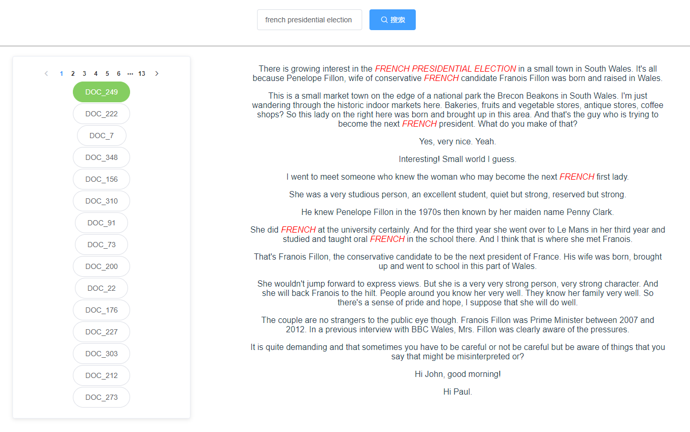

# 信息检索-空间向量模型
以2016 BBC英语新闻合集为语料库（理论上支持所有英文文档），完成建立空间向量模型和查询功能。

算法、后端Java实现，前端使用vue框架。前往网站 [**VSM Retrieval**](https://www.inforetrieval.xyz/vsmretrieval)

以下是工程以及网站使用简介，详细算法请阅读[**报告**](https://www.inforetrieval.xyz/api/2/download)

- [网站使用](#网站使用)
  - [1. 网站首页](#1-网站首页)
  - [2. 查询](#2-查询)
- [建立索引](#建立索引)
  - [文件流输出](#文件流输出)
  - [序列化输出](#序列化输出)
- [查询](#查询)

---

## 网站使用
[**VSM Retrieval**](https://www.inforetrieval.xyz/vsmretrieval) 使用vue-cli为前端框架，nginx做负载均衡和代理，SpringMVC为后端框架；分词实现使用stanford nlp包。

### 1. 网站首页

### 2. 查询

---

## 建立索引

以下简单描建立索引的算法。

为保证**直观性**和**高效性**，算法将生成两次索引，分别是输出*文件流*和*序列化*。

### 文件流输出
文件流索引的输出并不复杂，将词项对应文档或者文档对应的TF-iDF顺序输出即可。由于使用Stanford nlp包，未能对**中文**进行索引

### 序列化输出

序列化输出较为简单，使用kryo包，将相关数据结构整体输出到.dat文件中，读取时直接将该.dat文件映射到对应数据结构中，此方法效率极高，比java实现serializable接口效率高出10倍有余，具体方法请见[**报告**]("https://www.inforetrieval.xyz/api/2/download")

---

## 查询

查询将直接使用kryo读取.dat文件，获取倒排记录表以及需要的一些数据结构，计算查询字段和所有文档的**余弦相似度**，排序返回

---

若有进一步疑问，请至[报告](https://www.inforetrieval.xyz/api/files/download)

