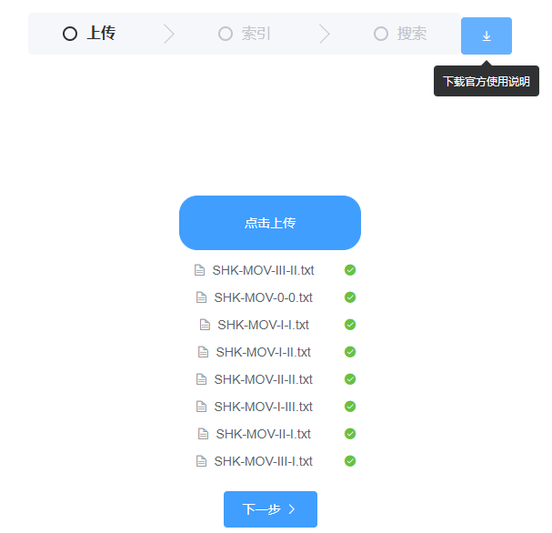
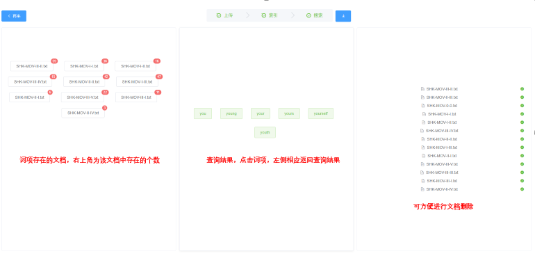

# 信息检索-布尔检索
以莎士比亚《威尼斯商人》剧本为资料库（理论上支持所有英文文档），完成建立索引和查询功能。

算法、后端Java实现，前端使用vue框架。前往网站 [Info Retrieval](https://www.inforetrieval.xyz)

以下是工程以及网站使用简介，详细算法请阅读[报告](https://www.inforetrieval.xyz/api/files/download)

> update：因组件bug，前端部份取消了上传以及建立索引的步骤，直接搜索即可

## 目录
- [网站使用](#网站使用)
- [建立索引](#建立索引)
- [查询](#查询)
- [参考](#参考)

---

## 网站使用
[InfoRetrieval](https://www.inforetrieval.xyz) 使用vue-cli为前端框架，nginx做负载均衡和代理，SpringMVC为后端框架；分词实现未使用nlp包，具体分词算法请至[报告](https://www.inforetrieval.xyz/api/files/download)。

> **！注意**，因时间关系，网站暂有业务逻辑未处理，使用时请谨慎。

### 1. 网站首页

建议先下载相关资料后再进行操作

### 2. 建立索引

强烈建议每次上传/删除文件后再次建立索引！

### 3. 查询

查询支持模糊查询，使用方法为在需要模糊查询的位置加入“*”

比如查询you*，将会返回所有以"you"开头的词项

> **！注意**，如果输入的词项不存在，系统默认为**输入错误**，将匹配与输入字符相似的几个词项。

---

## 建立索引

以下简单描建立索引的算法。

算法将生成两种索引，分别为*词项索引*和*k-gram索引*。

### 词项索引
词项索引较为简单，算法并未使用相关nlp语言包，只是对文档进行简单的分词处理，所以该项目并不能针对**中文**建立索引

### k-gram索引

算法采用2-gram，对每个词项处理生成2-gram索引，后续查询时有针对的使用词项索引和k-gram索引

---

## 查询

查询分为*普通查询*和*模糊查询*

### 普通查询

普通查询仅根据词项索引查询，当在索引定位到相应**Token**时，返回其倒排记录表和相应出现次数等信息

### 模糊查询

模糊查询根据k-gram索引，除了加入*的指定模糊查询，当普通查询无结果时也将调用模糊查询返回相似结果

---
## 参考

感谢jindongwang的基本[说明](https://github.com/jindongwang/informationretrieval/blob/master/README.md)

若有进一步疑问，请至[报告](https://www.inforetrieval.xyz/api/files/download)

